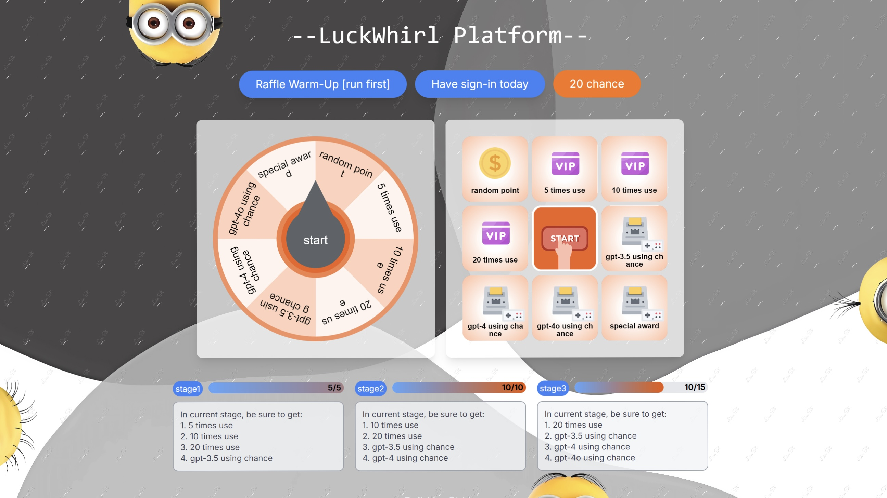
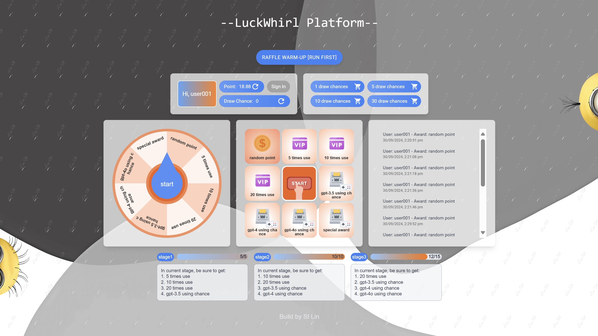

## 
LuckWhirl Platform

Experience URL: http://8.219.99.73/login

The project took more than half a year from requirement analysis, architecture learning, and design to coding implementation, and went through three versions of iterations.

---

Version 1.0

Version 2.0

Version 3.0

---

**LuckWhirl** is a robust and comprehensive marketing platform featuring functionalities such as **point accounts, daily sign-in rewards, virtual product exchanges, marketing lotteries, lottery unlocking, weighting systems, blacklists, and tiered lottery mechanisms.** It is an end-to-end project covering product management, requirement analysis, frontend and backend development, and DevOps practices. From architecture design to coding implementation and deployment, the system handles real-world scenarios, providing a seamless experience across both consumer-facing and operational workflows.

**The project is deployed on a 2-core 4GB cloud server. After launching, it is stress tested using JMeter, capable of supporting a single-machine throughput of 800 TPS (transactions per second), with a lottery interface response time of around 40 milliseconds.**

---

### Key Features:

1. **Lottery Action Flow**: Based on the e-commerce order placement process, a lottery action flow is built using the template method to define the standard lottery process.

2. **Decoupled Lottery Strategy**: To accommodate various lottery strategies and facilitate future strategy extensions, the lottery behavior is decoupled into the "during the lottery" and "after the lottery" phases.

   - **During the lottery**: The chain of responsibility pattern is used for blacklist filtering, weight-based filtering, and global lottery filtering.
   - **After the lottery**: A decision tree model using the composite pattern is applied for conditions like unlocking, stock management, and fallback prize filtering.

   The specific lottery strategy is configured through database tables, allowing the system to dynamically build the lottery responsibility chain and decision tree models based on business needs.

3. **Database Sharding for Scalability**: To handle large volumes of user lottery orders and winning records, the database is designed with sharding and partitioning to improve system concurrency. DBRouter is used for database and table routing, and the routing split key is manually set to control transactions across multiple data sources.

4. **Concurrent Prize Stock Deduction**: Considering the concurrency issues of the lottery, the design for prize stock deduction uses Redis `decr` to reduce stock and `setNx` for locking as a fallback mechanism. For successful stock deductions, an asynchronous delayed queue and scheduled tasks are used to slowly update stock, ensuring no overselling while reducing database pressure.

5. **Message Queue for Prize Distribution**: Message queues are used to decouple the prize distribution process, preventing the lottery chain from becoming too long. To ensure successful MQ message sending, prize distribution messages are written to a task table, with scheduled tasks scanning the table for MQ message compensation.

---

### Key Technologies:

- **Frontend**:
   - React
   - TypeScript

- **Backend**:
   - Spring & SpringBoot
   - MyBatis
   - RabbitMQ
   - Sharding-JDBC
   - Redis
   - MySQL
   - JMeter

- **DevOps**:
   - Git
   - Docker

- **Design Patterns and Architecture**:
   - DDD (Domain-Driven Design)
   - Factory Pattern, Strategy Pattern, Template Pattern, Composite Pattern

---

### System Modules:

1. **Activity and Strategy Initialization Assembly**: Manages the setup and configuration of marketing activities and strategies.

2. **Lottery Module**: Handles the entire process of lottery participation, from entry to prize distribution.

3. **Check-in Rebates and Points Redemption Module**: Manages user interactions for daily sign-in, rebate rewards, and virtual product redemptions.

---

### Inventory Control Mechanism:

The diagram below represents the **Inventory Control Mechanism**, ensuring smooth management and tracking of product stock throughout the marketing activities.

